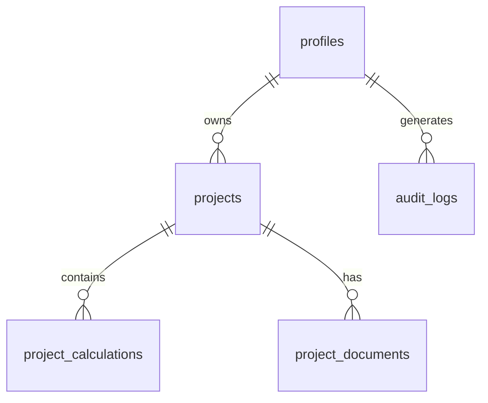

# Asphalt Management System - API Documentation

## Overview
This document provides comprehensive API documentation for the Asphalt Management System. The API is built using Supabase and provides RESTful endpoints for all application functionality.

## Authentication
All API requests require authentication using JWT tokens provided by Supabase Auth.

### Authentication Headers
```
Authorization: Bearer <jwt_token>
apikey: <supabase_anon_key>
```

## Base URL
```
https://your-project.supabase.co/rest/v1
```

## Endpoints

### Authentication

#### Sign Up
```http
POST /auth/v1/signup
Content-Type: application/json

{
  "email": "user@example.com",
  "password": "password123",
  "data": {
    "full_name": "John Doe",
    "company_name": "ABC Paving",
    "role": "contractor"
  }
}
```

#### Sign In
```http
POST /auth/v1/token?grant_type=password
Content-Type: application/json

{
  "email": "user@example.com",
  "password": "password123"
}
```

### User Profiles

#### Get User Profile
```http
GET /profiles?id=eq.<user_id>
Authorization: Bearer <jwt_token>
```

Response:
```json
{
  "id": "uuid",
  "email": "user@example.com",
  "full_name": "John Doe",
  "company_name": "ABC Paving",
  "role": "contractor",
  "created_at": "2024-01-01T00:00:00Z",
  "updated_at": "2024-01-01T00:00:00Z"
}
```

#### Update User Profile
```http
PATCH /profiles?id=eq.<user_id>
Authorization: Bearer <jwt_token>
Content-Type: application/json

{
  "full_name": "Jane Doe",
  "company_name": "XYZ Paving",
  "updated_at": "2024-01-01T00:00:00Z"
}
```

### Projects

#### List Projects
```http
GET /projects?user_id=eq.<user_id>
Authorization: Bearer <jwt_token>
```

Query Parameters:
- `status=eq.<status>` - Filter by project status
- `order=created_at.desc` - Sort projects
- `limit=10` - Limit results

Response:
```json
[
  {
    "id": "uuid",
    "name": "Main Street Parking Lot",
    "description": "Sealcoating and striping project",
    "status": "in_progress",
    "location": "123 Main St, City, State",
    "start_date": "2024-01-15",
    "end_date": "2024-01-20",
    "user_id": "uuid",
    "created_at": "2024-01-01T00:00:00Z",
    "updated_at": "2024-01-01T00:00:00Z"
  }
]
```

#### Create Project
```http
POST /projects
Authorization: Bearer <jwt_token>
Content-Type: application/json

{
  "name": "New Project",
  "description": "Project description",
  "status": "planning",
  "location": "Project location",
  "start_date": "2024-02-01",
  "end_date": "2024-02-05",
  "user_id": "uuid"
}
```

#### Update Project
```http
PATCH /projects?id=eq.<project_id>
Authorization: Bearer <jwt_token>
Content-Type: application/json

{
  "status": "completed",
  "updated_at": "2024-01-01T00:00:00Z"
}
```

#### Delete Project
```http
DELETE /projects?id=eq.<project_id>
Authorization: Bearer <jwt_token>
```

### Project Calculations

#### List Calculations
```http
GET /project_calculations?project_id=eq.<project_id>
Authorization: Bearer <jwt_token>
```

Response:
```json
[
  {
    "id": "uuid",
    "project_id": "uuid",
    "calculation_type": "sealcoat",
    "inputs": {
      "square_feet": 10000,
      "coats": 1,
      "sealer_type": "coal-tar"
    },
    "results": {
      "concentrated_sealer": 250,
      "water_needed": 50,
      "total_cost": 1250
    },
    "created_at": "2024-01-01T00:00:00Z",
    "updated_at": "2024-01-01T00:00:00Z"
  }
]
```

#### Save Calculation
```http
POST /project_calculations
Authorization: Bearer <jwt_token>
Content-Type: application/json

{
  "project_id": "uuid",
  "calculation_type": "sealcoat",
  "inputs": {
    "square_feet": 10000,
    "coats": 1,
    "sealer_type": "coal-tar",
    "application_rate": 0.15
  },
  "results": {
    "concentrated_sealer": 250,
    "water_needed": 50,
    "sand_needed": 100,
    "total_cost": 1250,
    "coverage": 40
  }
}
```

## Calculation Formulas

### Sealcoat Calculator

#### Material Calculations
```javascript
// Square yards conversion
const squareYards = squareFeet / 9;

// Base sealer needed (gallons)
const baseSealerGallons = squareYards * applicationRate * numberOfCoats;

// Water calculation (based on mix ratio)
const waterGallons = baseSealerGallons * (waterRatio / 100);

// Sand calculation (pounds per gallon of sealer)
const sandPounds = baseSealerGallons * (sandPerGallon || 6);

// Cost calculation
const totalCost = (baseSealerGallons * sealerCostPerGallon) + 
                  (sandPounds * sandCostPerPound) + 
                  laborCosts;
```

### Striping Calculator

#### Paint Volume Calculation
```javascript
// Linear feet to gallons conversion
const paintGallons = totalLinearFeet / coveragePerGallon;

// Multiple coats adjustment
const totalPaintGallons = paintGallons * numberOfCoats;

// Line width adjustment factor
const widthFactor = lineWidth / 4; // 4 inches standard
const adjustedGallons = totalPaintGallons * widthFactor;
```

## Error Handling

### Error Response Format
```json
{
  "error": {
    "message": "Error description",
    "details": "Detailed error information",
    "hint": "Suggestion for resolution",
    "code": "ERROR_CODE"
  }
}
```

### Common Error Codes
- `PGRST116` - Row not found
- `23505` - Unique constraint violation
- `42501` - Insufficient privileges
- `23503` - Foreign key constraint violation

## Rate Limiting
- API requests are limited to 100 requests per minute per user
- Bulk operations have separate limits
- Rate limit headers are included in responses:
  - `X-RateLimit-Limit`
  - `X-RateLimit-Remaining`
  - `X-RateLimit-Reset`

## Data Types

### Project Status
```typescript
type ProjectStatus = 'planning' | 'in_progress' | 'completed' | 'on_hold';
```

### User Role
```typescript
type UserRole = 'contractor' | 'supervisor' | 'admin';
```

### Calculation Type
```typescript
type CalculationType = 'sealcoat' | 'striping' | 'material' | 'cost';
```

## Webhooks

### Available Events
- `project.created` - New project created
- `project.updated` - Project status changed
- `calculation.saved` - New calculation saved
- `user.profile_updated` - User profile modified

### Webhook Payload Example
```json
{
  "event": "project.created",
  "created_at": "2024-01-01T00:00:00Z",
  "data": {
    "id": "uuid",
    "name": "New Project",
    "user_id": "uuid"
  }
}
```

## SDKs and Libraries

### JavaScript/TypeScript
```bash
npm install @supabase/supabase-js
```

```javascript
import { createClient } from '@supabase/supabase-js'

const supabase = createClient(
  'https://your-project.supabase.co',
  'your-anon-key'
)

// Example usage
const { data, error } = await supabase
  .from('projects')
  .select('*')
  .eq('user_id', userId)
```

## Real-time Subscriptions

### Subscribe to Project Changes
```javascript
const subscription = supabase
  .channel('projects')
  .on('postgres_changes', {
    event: '*',
    schema: 'public',
    table: 'projects',
    filter: `user_id=eq.${userId}`
  }, (payload) => {
    console.log('Project updated:', payload)
  })
  .subscribe()
```

## Security

### Row Level Security (RLS)
All tables implement RLS policies to ensure users can only access their own data:

```sql
-- Projects table policy
CREATE POLICY "Users can only access their own projects" 
ON projects FOR ALL 
USING (auth.uid() = user_id);

-- Calculations table policy  
CREATE POLICY "Users can only access calculations for their projects"
ON project_calculations FOR ALL
USING (
  project_id IN (
    SELECT id FROM projects WHERE user_id = auth.uid()
  )
);
```

### API Key Security
- Use environment variables for API keys
- Rotate keys regularly
- Use service role keys only on server-side
- Monitor API usage for anomalies

## Testing

### API Testing with cURL
```bash
# Test authentication
curl -X POST 'https://your-project.supabase.co/auth/v1/token?grant_type=password' \
-H "apikey: YOUR_ANON_KEY" \
-H "Content-Type: application/json" \
-d '{
  "email": "test@example.com",
  "password": "password123"
}'

# Test project creation
curl -X POST 'https://your-project.supabase.co/rest/v1/projects' \
-H "apikey: YOUR_ANON_KEY" \
-H "Authorization: Bearer YOUR_JWT_TOKEN" \
-H "Content-Type: application/json" \
-d '{
  "name": "Test Project",
  "location": "Test Location",
  "status": "planning"
}'
```

## Database Schema

### Tables Overview
- `profiles` - User profile information
- `projects` - Project data
- `project_calculations` - Saved calculations
- `project_documents` - File attachments
- `audit_logs` - Activity tracking

### Relationships


---

*Last updated: [Current Date]*
*API Version: v1.0*

For technical support or API issues, please contact our development team.